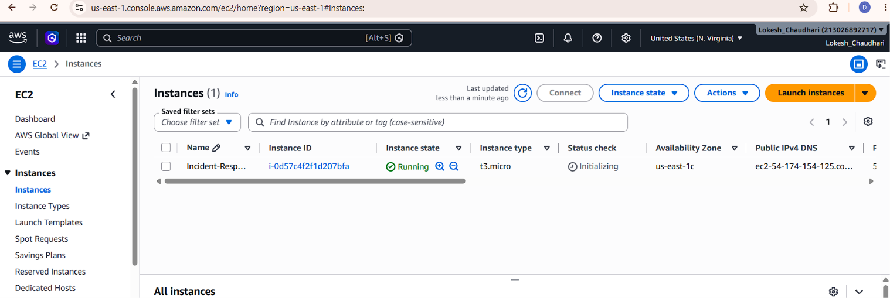
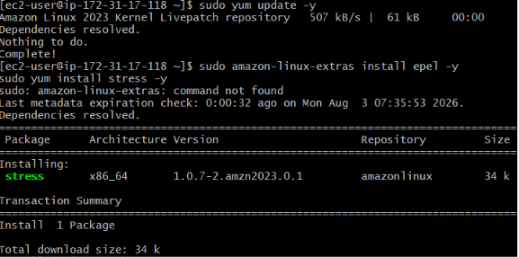
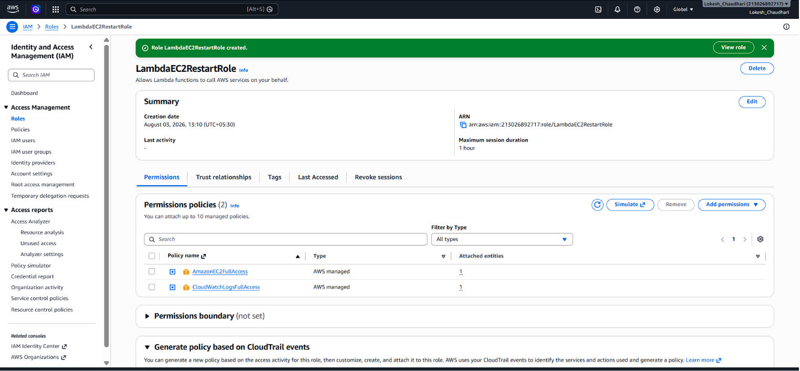
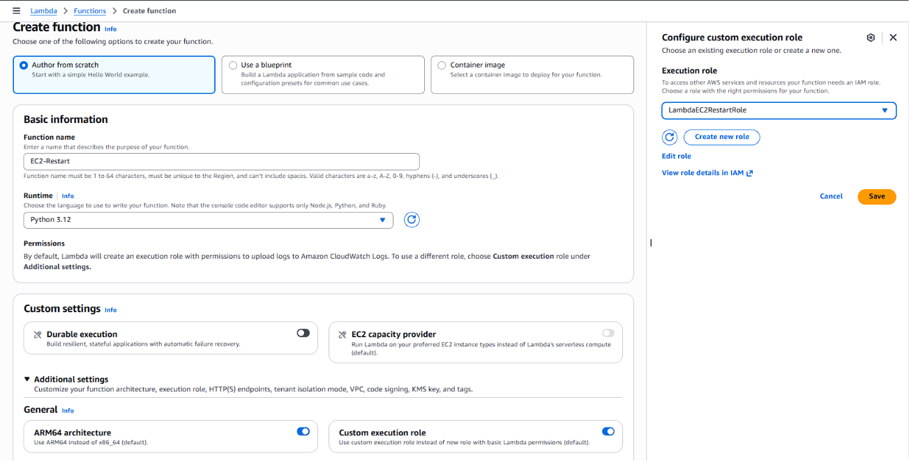
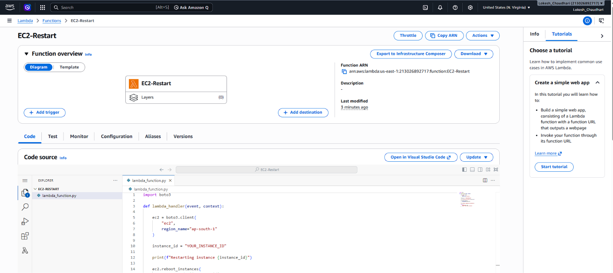
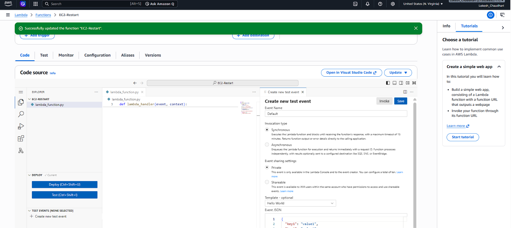
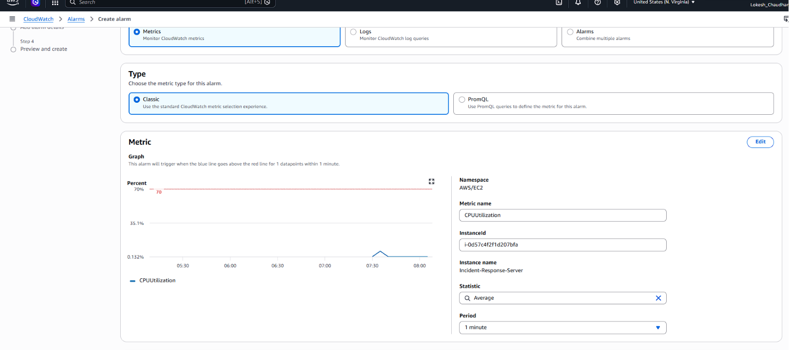
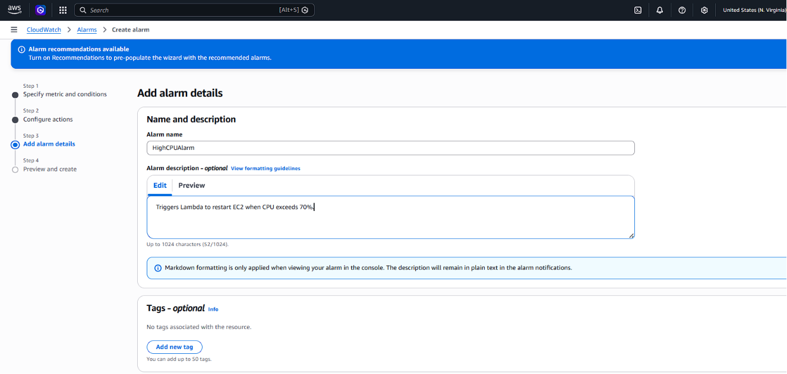
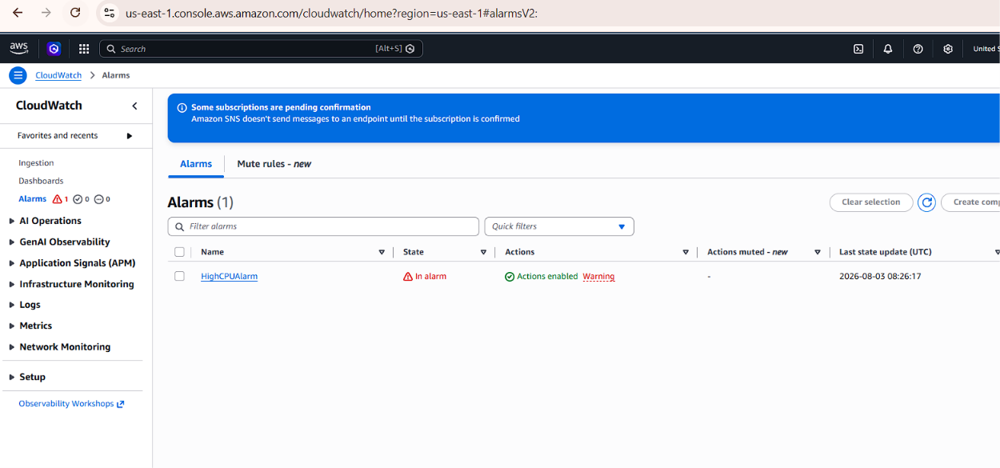
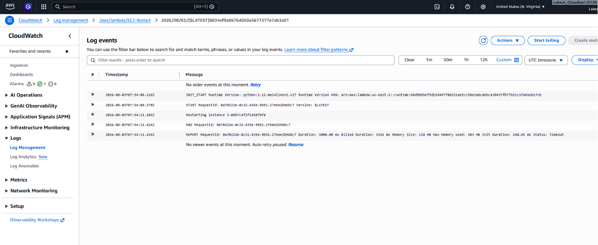

# 🚀 Automated Incident Response System using CloudWatch Alarms and LambdaRemediation

## 📌 Project Overview

This project demonstrates an **Automated Incident Response System** built using AWS services. The solution continuously monitors the CPU utilization of an Amazon EC2 instance using Amazon CloudWatch. When the CPU usage exceeds a predefined threshold, CloudWatch automatically triggers an AWS Lambda function that reboots the EC2 instance, creating a simple **self-healing infrastructure**.

This project showcases how cloud automation can reduce downtime, minimize manual intervention, and improve infrastructure reliability.

---

## 🧠 Architecture

```text
                High CPU Usage
                      │
                      ▼
          CloudWatch Alarm (CPU > 70%)
                      │
                      ▼
          AWS Lambda Function
                      │
                      ▼
            Restart EC2 Instance
                      │
                      ▼
             CloudWatch Logs
```

---

## 🎯 Objectives

- Monitor EC2 CPU utilization using Amazon CloudWatch.
- Detect CPU threshold breaches automatically.
- Trigger automated remediation using AWS Lambda.
- Restart the EC2 instance without manual intervention.
- Record all remediation activities in CloudWatch Logs.

---

## 🛠️ Technologies Used

- Amazon EC2
- Amazon CloudWatch
- AWS Lambda
- AWS IAM
- Amazon CloudWatch Logs
- Python (Boto3)
- Amazon Linux

---

# ⚙️ Implementation Steps

## 🔹 Step 1: Launch an EC2 Instance

1. Open the **AWS Management Console**.
2. Navigate to **EC2**.
3. Click **Launch Instance**.
4. Configure the instance:
   - **Name:** Incident-Response-Server
   - **AMI:** Amazon Linux
   - **Instance Type:** t3.micro
   - **Key Pair:** Create or select an existing key pair.
5. Configure the Security Group:
   - Allow **SSH (Port 22)** from your IP.
6. Launch the instance.
7. Copy the **Instance ID** and **Public IP**.



---

## 🔹 Step 2: Connect to the EC2 Instance

SSH into the server.

```bash
ssh -i demo.pem ec2-user@<Public-IP>
```

Update the system.

```bash
sudo yum update -y
```

Install the stress utility.

```bash
sudo amazon-linux-extras install epel -y
sudo yum install stress -y
```

Verify installation.

```bash
stress --version
```

---

## 🔹 Step 3: Create an IAM Role for Lambda

1. Go to **IAM → Roles**.
2. Click **Create Role**.
3. Select **AWS Service → Lambda**.
4. Attach the following policies:
   - AmazonEC2FullAccess
   - CloudWatchLogsFullAccess
5. Role Name:

```
LambdaEC2RestartRole
```

6. Click **Create Role**.


---


## 🔹 Step 4: Create the Lambda Function

1. Navigate to **AWS Lambda**.
2. Click **Create Function**.
3. Configure:
   - Function Name: **EC2-Restart**
   - Runtime: **Python 3.12**
4. Select the IAM role created previously.
5. Click **Create Function**.




---

## 🔹 Step 5: Add the Lambda Code

Replace the default code with:

```python
import boto3

def lambda_handler(event, context):

    ec2 = boto3.client(
        "ec2",
        region_name="ap-south-1"
    )

    instance_id = "YOUR_INSTANCE_ID"

    print(f"Restarting instance {instance_id}")

    ec2.reboot_instances(
        InstanceIds=[instance_id]
    )

    print("Restart command sent successfully")

    return {
        "statusCode": 200,
        "body": "EC2 Restart Triggered"
    }
```




Click **Deploy**.

---

## 🔹 Step 6: Test the Lambda Function

1. Click **Test**.
2. Create a default test event.
3. Click **Invoke**.
4. Verify that the EC2 instance begins rebooting.
5. Check the execution logs in CloudWatch.

---



## 🔹 Step 7: Configure CloudWatch Alarm

1. Navigate to:

```
CloudWatch → Alarms → Create Alarm
```

2. Select:

```
EC2
→ Per Instance Metrics
→ CPUUtilization
```

3. Configure:

- Statistic: Average
- Period: 1 Minute
- Threshold: Greater than 70%
- Evaluation Periods: 2
- Datapoints to Alarm: 2 of 2

4. Click **Next**.





---

## 🔹 Step 8: Connect the Alarm to Lambda

Under **Alarm Actions**:

- Select **Invoke Lambda Function**
- Choose **EC2-Restart**
- Name the alarm:

```
HighCPUAlarm
```

- Click **Create Alarm**

---


## 🔹 Step 9: Generate CPU Load

Connect to the EC2 instance.

Run:

```bash
stress --cpu 2 --timeout 300
```

This generates high CPU utilization for five minutes.

---

## 🔹 Step 10: Verify Automation

Monitor the following AWS services.

### CloudWatch Alarm

The alarm state changes:

```
OK
        ↓
ALARM
```


### Lambda

The Lambda function is automatically triggered.

### EC2

The instance is rebooted automatically.

### CloudWatch Logs

Expected output:

```
Restarting instance: i-xxxxxxxxxxxx

Restart command sent successfully
```

### EC2 System Logs

Expected entries:

```
systemd-shutdown: Rebooting

Restarting system
```



---

# 📊 Validation Proof

### ✅ CloudWatch Alarm

- Alarm changes from **OK** to **ALARM**

### ✅ Lambda Execution

- Function invoked successfully
- Execution logs generated

### ✅ CloudWatch Logs

```
Restarting instance: i-xxxxxxxx

Restart command sent successfully
```

### ✅ EC2 System Logs

```
systemd-shutdown: Rebooting

Restarting system
```

---

# 🔍 Key Features

- Real-time infrastructure monitoring
- Automated incident remediation
- Self-healing cloud architecture
- CloudWatch logging and auditing
- Serverless automation using AWS Lambda

---

# ⚠️ Challenges Faced

- Lambda execution timeout
- IAM permission configuration
- Region mismatch between Lambda and EC2
- CloudWatch alarm evaluation timing
- Installing the **stress** package on Amazon Linux

---

# 💡 Learnings

- CloudWatch metrics and alarm configuration
- AWS Lambda execution flow
- IAM roles and permissions
- CloudWatch Logs for troubleshooting
- Building self-healing infrastructure on AWS

---

# 🚀 Future Enhancements

- Integrate Amazon SNS email notifications
- Trigger Slack alerts
- Scale Auto Scaling Groups instead of restarting EC2
- Provision infrastructure using Terraform
- Support multiple EC2 instances dynamically

---

# 🎯 Conclusion

This project demonstrates a practical implementation of an **Automated Incident Response System** using AWS services. By combining Amazon CloudWatch, AWS Lambda, IAM, and EC2, the solution automatically detects high CPU utilization and performs remediation without manual intervention.

The project highlights the power of cloud automation, improving application availability, reducing operational effort, and building resilient, self-healing infrastructure.

---

## 👩‍💻 Author

**Dhanashri Chaudhari**

Cloud & DevOps Enthusiast 🚀
